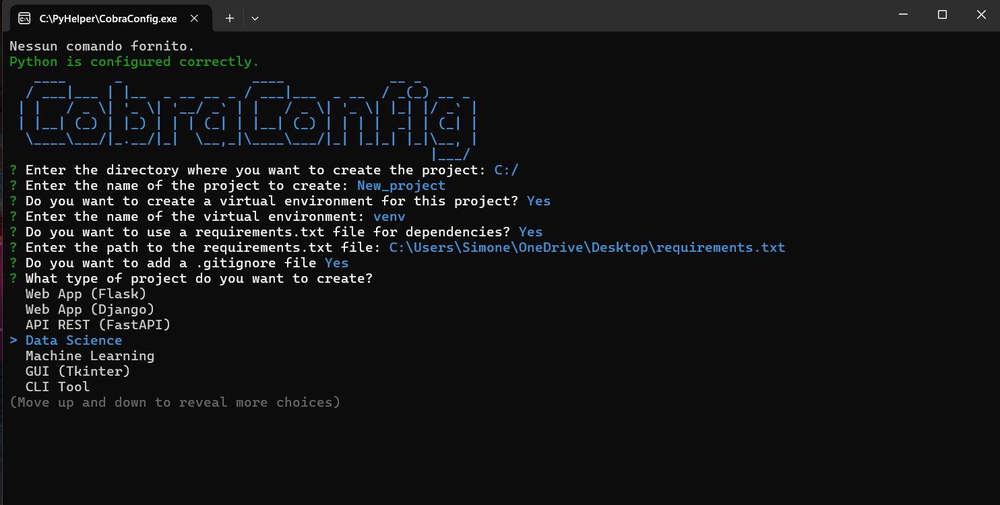

<p align="center">
  
</p>
<h1 align="center">CobraConfig 🐍</h1>


<h3 align="center">the python tool that you can't miss</h3>


________________________

## WHAT DO I NEED IT FOR? ❓
Create your next Python project neatly and faster, don't waste time.

## HOW IT WORKS? ⚙️
Simple: fill out the form according to your needs and you're done!

## WHAT CAN IT DO FOR ME? 🪄
Data Analyst? Python UI Designer? AI Engineer? Web Developer? Or a simple newbie? CobraConfig structures your project according to your ideas: for AI, Web Apps, API, Data Science, Maching Learning or GUI. 
It can also speed up the build process by immediately configuring the virtual environment, dependencies, git config and more!!



## WHY AM I STILL READING THIS README AND NOT DOWNLOADING COBRACONFIG? 🤡
You tell me! Get a move on and look at the [releases](https://github.com/FrogPossibility/CobraConfig/releases/tag/v.1.0.0) for the installer!!


________________________

## HOW TO BUILD
1. download the source code with git:
```
git clone https://github.com/FrogPossibility/CobraConfig.git
cd CobraConfig
```

2. install the dependencies:
```
npm install
```

3. test it:
```
node main.js
```

3. build it:
```
npm run build
```
