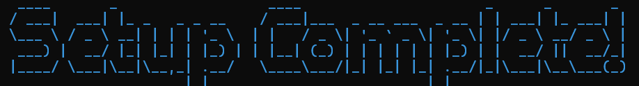

<p align="center">
  
</p>
<p align="center">
  
</p>

<p align="center">
  
  
  
</p>

__________
```
npm install cobraconfig
npx cobraconfig
```

<p align="center">
  
  
  
  
  
  
  
  
  
  
  
  
  :trollface: :trollface: :trollface:
</p>

- NPM : https://www.npmjs.com/package/cobraconfig
- DEV.to : https://dev.to/frogpossibility
- GITHUB : https://github.com/FrogPossibility

________________________

## WHAT DO I NEED IT FOR? ❓
Create your next Python project neatly and faster, don't waste time. :shipit:

## HOW IT WORKS? ⚙️
Simple: fill out the form according to your needs and you're done! :neckbeard:

## WHAT CAN IT DO FOR ME? 🪄
Data Analyst? Python UI Designer? AI Engineer? Web Developer? Or a simple newbie? CobraConfig structures your project according to your ideas: for AI, Web Apps, API, Data Science, Maching Learning or GUI. 
It can also speed up the build process by immediately configuring the virtual environment, dependencies, git config and more!!


## WHY AM I STILL READING THIS README AND NOT DOWNLOADING COBRACONFIG? 📦
You tell me! Get a move on and look at the [releases](https://github.com/FrogPossibility/CobraConfig/releases/tag/v.1.2.1-x64) for the installer!!



________________________

## HOW TO BUILD
1. download the source code with git:
```
git clone https://github.com/FrogPossibility/CobraConfig.git
cd CobraConfig
```

2. install the dependencies:
```
npm install
```

3. test it:
```
node main.js
```

3. build it:
```
npm run build
```

## Star History

<a href="https://star-history.com/#FrogPossibility/CobraConfig&Date">
 <picture>
   <source media="(prefers-color-scheme: dark)" srcset="https://api.star-history.com/svg?repos=FrogPossibility/CobraConfig&type=Date&theme=dark" />
   <source media="(prefers-color-scheme: light)" srcset="https://api.star-history.com/svg?repos=FrogPossibility/CobraConfig&type=Date" />
   
 </picture>
</a>

## TO DO:

- [X]  ~~put the project on NPM so it can be used without install. It would be nice to run `npx cobraConfig` to launch this.~~
- [ ] adding a real-time project structure of the project that will be created

<p align="center">
  
  
  
  
</p>


